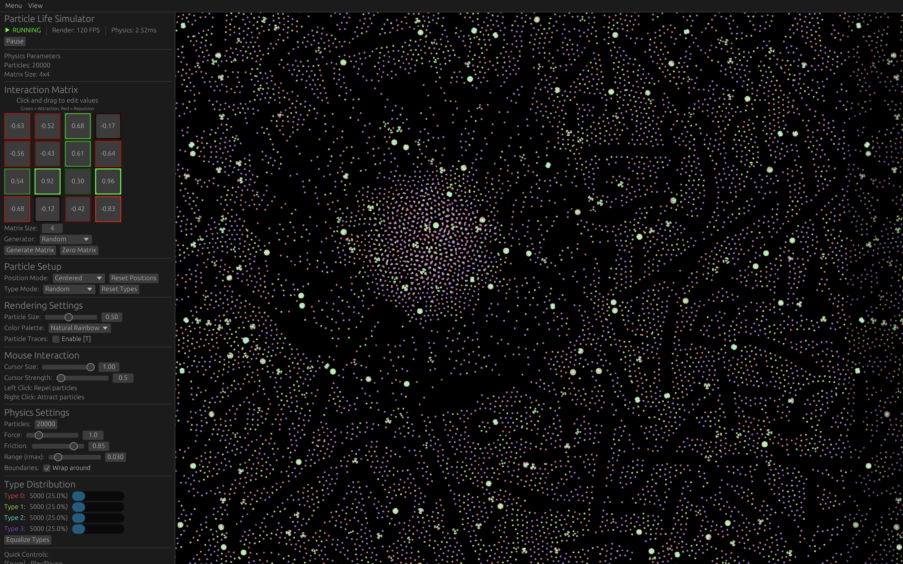
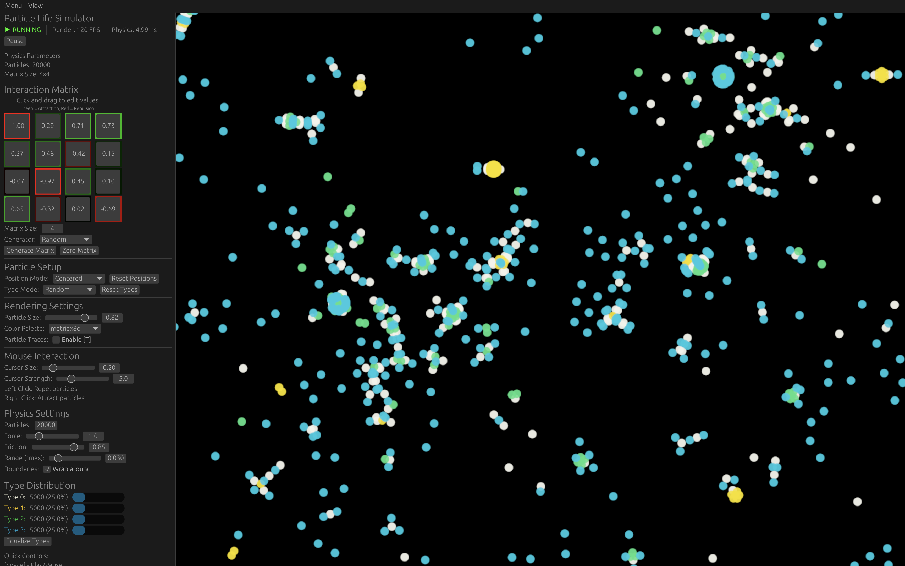
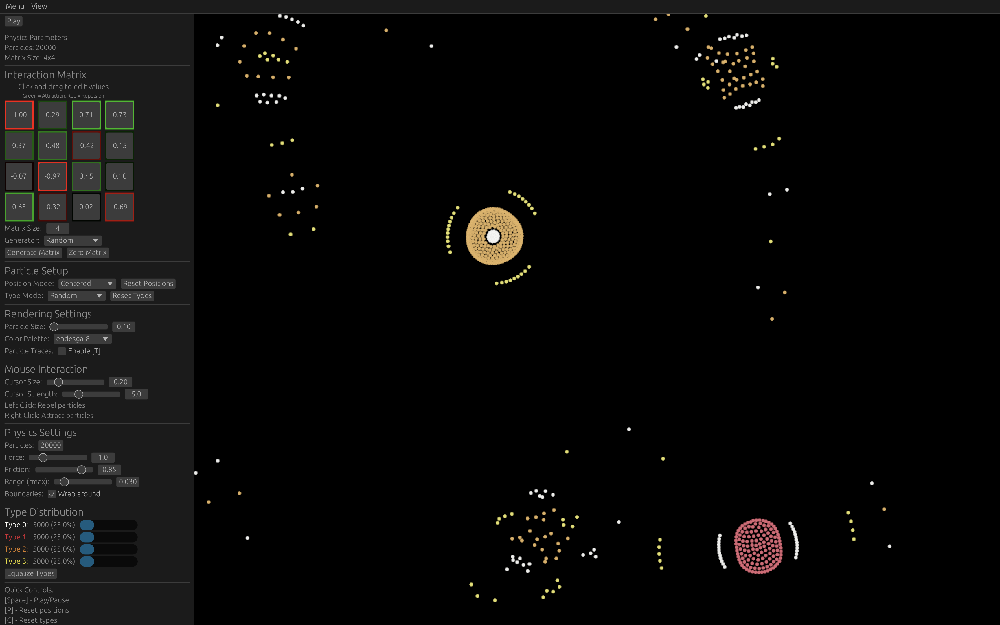
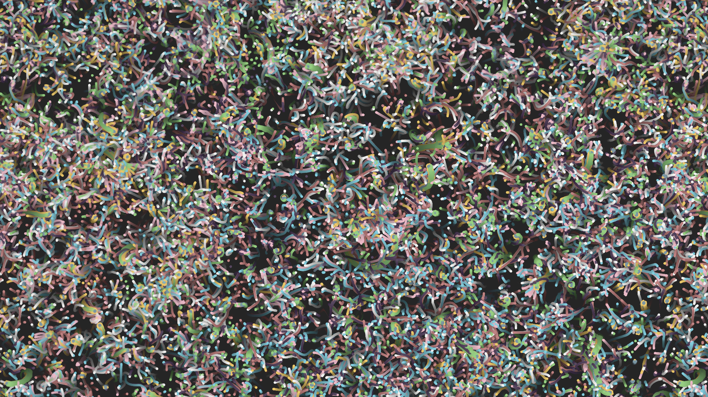
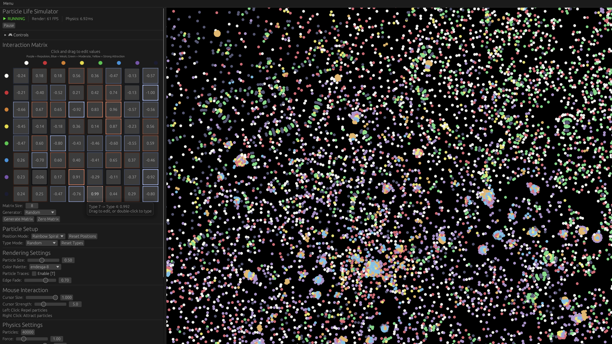

# Particle Life

An interactive particle life simulation based on several sources, mainly [particle-life.com](https://particle-life.com). This is a GPU-accelerated implementation that demonstrates emergent behavior through simple interaction rules.







## Features

- GPU-accelerated particle rendering and physics
- Multiple particle types with configurable interaction rules
- Various initial position patterns and type distributions
- Interactive camera controls and particle manipulation
- Configurable color palettes
- Particle trails and fade effects
- Mouse-based particle interaction (attract/repel)

## Running the app

```bash
cargo run --release
```

## Controls

### Camera Controls
- `W/A/S/D` or Arrow Keys - Move camera
- `Mouse scroll` - Zoom in/out
- `Shift + Z` - Reset camera with zoom
- `Z` - Reset camera without zoom

### Simulation Controls
- `Space` - Pause/Resume simulation
- `P` - Regenerate particle positions
- `C` - Regenerate particle types
- `M` - Generate new interaction matrix
- `B` - Toggle world wrapping
- `T` - Toggle particle trails
- `Shift + Scroll` - Adjust particle size
- `Ctrl + Shift + Scroll` - Adjust simulation speed

### Mouse Interaction
- Left Click + Drag - Repel particles
- Right Click + Drag - Attract particles

### UI Controls
- `/` - Toggle GUI visibility
- `Esc` - Exit application

## References

- [Flow-Lenia: Towards open-ended evolution in cellular automata through mass conservation and parameter localization](https://arxiv.org/pdf/2212.07906)
- [ALIEN - Explore worlds of artificial life](https://github.com/chrxh/alien)
- [Particle Life Simulation](https://github.com/hunar4321/particle-life)